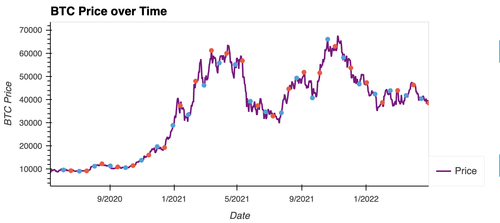

# group-repo
first group project repo
jared was here
# Lunar Lotto
##### Jared Dylan and Jordan Clayton
#
62.50% is the percentage of times you would profit if you bought BTC on the full moon and sold it on the new moon of every month!
​
### Words are dumb. Here are some photos of our findings:
​

​
# Next Steps:
## Moon Data/Fear & Greed Data Analysis
- Create new column for fear_value
- Populate fear_value column with data from FearGreedURL
- Merge these new columns with moon_merge
- Create new column in moon_merge that indicates everytime a new All Time High has been reached in BTC price
- Create new column in moon_merge that indicates everytime a new All Time Low has been reached in BTC Price
- Calculate the correlation between BTC Price and Moon Phases
- Calculate correlation between BTC Price and Fear and Greed index values
- Compare the correlation Between Moon Phase vs BTC Price and Fear and Greed vs BTC Price
## Future Predictions
- Use Scikit Learn, TensorFlow, Kera models to make future predictions of price behavior
- First use simple univariate Long short-term memory model that predicts based on previous days price actions to make future predictions (control)
- Use multivariate models incorporating moon phase and fear & greed indicators created in previous section to make future predictions.
- Test the two models on historical price data and compare accuracy
- optimal buy and sell periods around moon phases